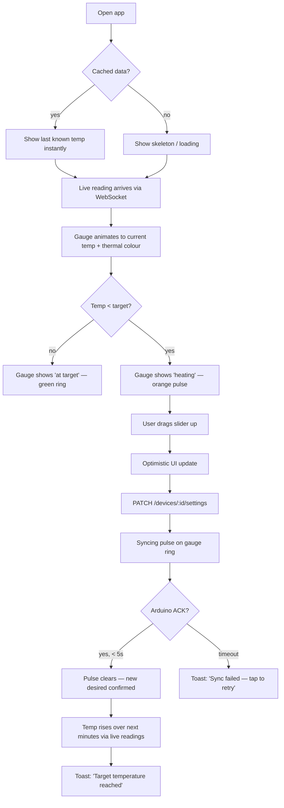
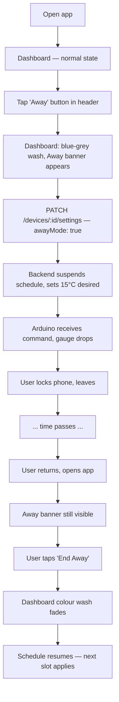
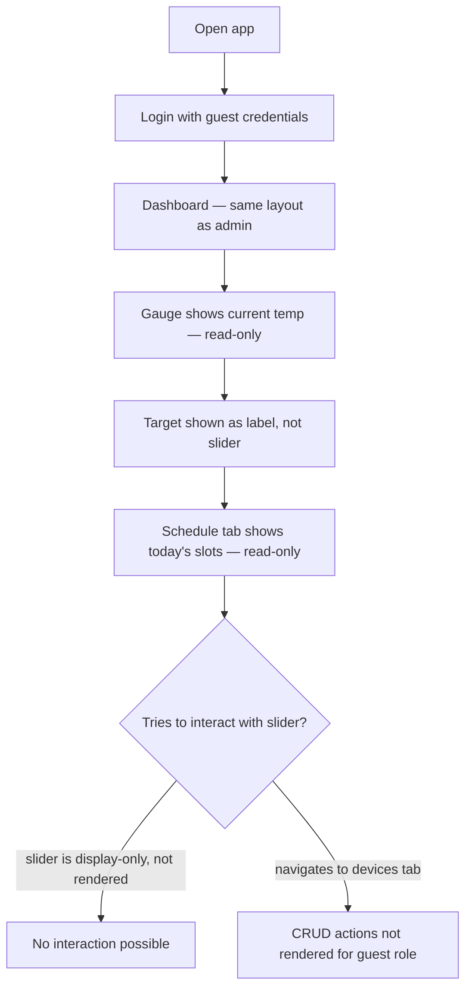
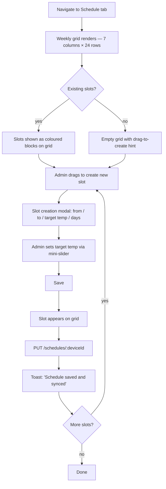
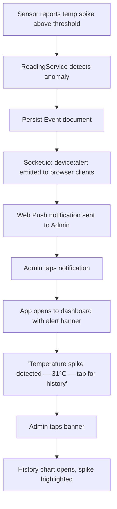

# UX Design Specification — Smart Thermostat Controller

**Author:** Project Owner
**Date:** 2026-03-03
**Version:** 1.0

---

## Executive Summary

### Project Vision

A self-hosted smart thermostat web app that gives a household owner genuine real-time control over home temperature — without being locked into a proprietary ecosystem. The interface must feel as immediate and trustworthy as a physical thermostat while adding the richness only a digital screen can provide: history charts, schedules, push alerts, and per-room views.

### Target Users

**Admin (household owner)**
- Primary user; performs all configuration, control, and monitoring
- Tech-comfortable but not necessarily a developer
- Uses the app on phone (quick checks, away toggle) and desktop (schedule building, history review)
- Expects the app to feel as responsive as a native app — no perceptible lag on a temperature change

**Guest (family member)**
- Secondary user; view-only access
- Needs to glance at current temperature and today's schedule without confusion
- Should never encounter write-blocked UI — read-only actions only, no disabled buttons

### Key Design Challenges

1. **Live data trust** — the temperature gauge must feel live, not stale. Users need to immediately know whether what they see is current (< 5 s old) or from cache.
2. **Slider precision vs. safety** — setting target temperature via a slider is fast but imprecise; safety thresholds add invisible walls the user needs to understand without friction.
3. **Away mode vs. schedule conflict** — when Away mode is active, the schedule is suspended. The UI must make this state obvious so users don't return home confused about why the house is cold.
4. **Role clarity without friction** — Guest users must see the full UI as read-only, not a broken UI with disabled controls. The experience should feel intentional, not restricted.
5. **Simulator → Arduino transition** — during development the source is simulated; the UI must not expose or reflect this implementation detail.

### Design Opportunities

1. **Thermal colour as ambient data** — hue shifts from cool blue → warm red as temperature rises, giving users an instant emotional read without looking at numbers.
2. **Shadow delta as progress** — showing `desired` vs `reported` temperature as a pending animation creates a satisfying feedback loop when the Arduino responds.
3. **Schedule builder as drag-and-drop week grid** — a visual weekly calendar with draggable time blocks is far more natural than a form-based slot editor.
4. **Dashboard as a single-glance summary** — one screen should answer "is my home at the right temperature right now?" in under 2 seconds.

---

## Core User Experience

### Defining Experience

> "Glance at the dashboard and know — in under two seconds — whether your home is at the right temperature. Adjust it with a single slider drag. Done."

This is the defining interaction. Everything else (schedules, history, alerts) supports this core loop. If this moment is fast, legible, and satisfying, the product succeeds.

### Platform Strategy

- **Primary platform:** Responsive web app (React + Vite), mobile-first layout
- **Mobile (375 px+):** Bottom navigation bar, large touch targets (≥ 44 × 44 px), one-handed reach for primary controls
- **Tablet (768 px+):** Two-column layout — gauge + controls left, history chart right
- **Desktop (1024 px+):** Sidebar navigation, multi-panel dashboard with gauge, chart, and today's schedule visible simultaneously
- **No native app** (out of scope) but the web app must feel native on mobile — no horizontal scroll, no tiny tap targets

### Effortless Interactions

- Temperature reading updates without any user action (WebSocket push)
- Target temperature slider drag requires no confirmation dialog — optimistic update, silent rollback on error
- Away mode toggled with a single tap — no modal, no "are you sure"
- Push notifications arrive without the user having the app open

### Critical Success Moments

| Moment | Success Looks Like |
|--------|--------------------|
| Opening the app | Current temp visible within 1 s, no spinner required (cached data shown immediately, live update arrives silently) |
| Dragging the target slider | Gauge label updates optimistically; a subtle "syncing" pulse appears until Arduino ACKs |
| Activating Away mode | The entire dashboard header tints blue-grey and a banner reads "Away mode — 15 °C until you return" |
| Receiving a push notification | Tap opens directly to the relevant device card, not the home screen |
| Schedule saved | A toast confirms "Schedule saved and synced to device" — no full page reload |

### Experience Principles

1. **Show, don't ask** — ambient information (current temp, device status, away mode) is always visible without navigation
2. **Optimistic by default** — UI updates immediately on user action; errors are toasts, not blocking modals
3. **Temperature is the hero** — the current temperature number is always the largest, most prominent element on screen
4. **State is unambiguous** — desired ≠ reported, away mode active, device offline — each state has a distinct, unmistakable visual treatment
5. **Guests see the same UI** — read-only experience is achieved by showing controls as display-only, not by hiding or disabling them

---

## Desired Emotional Response

### Primary Emotional Goals

| Stage | Target Emotion |
|-------|---------------|
| Opening app | **Confidence** — "I can see exactly what's happening" |
| Making a change | **Control** — "My action had an immediate effect" |
| Viewing history | **Insight** — "I understand my home's patterns" |
| Away mode active | **Calm** — "The house is taken care of, I don't need to think about it" |
| Alert received | **Informed, not alarmed** — important information, not panic |

### Emotional Journey Mapping

```
Discover → Trust → Control → Habit

Discover:  First login — sees live temperature. "Oh, it actually works."
Trust:     Adjusts target, watches gauge climb. "It responded."
Control:   Builds first schedule. "Now it runs itself."
Habit:     Glances at dashboard twice a day. "This is just part of my home."
```

### Micro-Emotions

- **Confidence over anxiety** — status indicators (online, syncing, offline) always visible, never hidden
- **Accomplishment over frustration** — slider feedback is tactile; "target reached" toast feels like a reward
- **Delight in the thermal palette** — the colour shift is a small moment of joy that makes the data feel alive
- **Trust in the data** — timestamps on readings ("updated 3 s ago") prevent doubt about data freshness

### Design Implications

| Emotion | UX Decision |
|---------|-------------|
| Confidence | Device status badge always in header; offline state is red + label, never silent |
| Control | Slider has haptic-style snap points at round numbers (18, 19, 20...) |
| Calm (away mode) | Colour wash over entire dashboard, not just a badge |
| Insight | Chart defaults to 7-day view with current day highlighted |
| Delight | Temperature gauge hue animates smoothly, not in discrete steps |

---

## UX Pattern Analysis & Inspiration

### Inspiring Products Analysis

**Nest Thermostat app**
- Circular temperature dial is iconic but complex — teaches that temperature control can be a primary visual metaphor
- What it does well: temperature as hero, clean status states
- What to avoid: over-reliance on proprietary circular dial pattern; confusing multi-device switching

**Apple Home / HomeKit**
- Room-based navigation is intuitive at scale
- What to adopt: tile-based room cards with live temperature readout
- What to avoid: the cluttered accessory grid on first launch

**Linear (project management)**
- Real-time optimistic UI updates done right — changes appear instantly, sync happens silently
- What to adopt: optimistic update + silent background sync + toast-only error pattern

**Robinhood**
- Live data with ambient colour (green/red) gives instant emotional read without numbers
- What to adopt: thermal colour as ambient indicator for temperature state

### Transferable UX Patterns

**From Nest:** Large, legible temperature number as the screen hero
**From Apple Home:** Room card tiles for per-room navigation (Phase 3)
**From Linear:** Optimistic mutations with silent background sync
**From Robinhood:** Ambient colour that communicates data emotionally before the user reads a number

### Anti-Patterns to Avoid

- **Confirmation modals for reversible actions** — target temperature changes are cheap to undo; no "are you sure?"
- **Disabled controls for Guest role** — a greyed-out slider is confusing; display-only is cleaner
- **Full-page spinners on data refresh** — cached data shown immediately, live update arrives silently
- **Hiding device status** — never bury the online/offline indicator in a settings page
- **Form-per-schedule-slot** — a table of text inputs for schedule management is unusable on mobile

### Design Inspiration Strategy

| Decision | Approach |
|----------|----------|
| Temperature hero | Large circular gauge, current temperature at 48–64 px, thermal colour ring |
| Optimistic updates | Mutation fires instantly; "syncing" micro-animation; toast on error |
| Room navigation | Tile grid (Phase 3); single device view for MVP |
| Schedule builder | Drag-on weekly grid, not a form |
| Away mode | Full-dashboard colour wash — warm grey/blue tint, prominent banner |

---

## Design System Foundation

### Design System Choice

**Tailwind CSS + Headless UI (Radix UI primitives)**

Rationale:
- Utility-first CSS aligns with the custom thermal colour system — CSS custom properties (`--temp-hue`) can be driven from React state
- Radix UI provides accessible, unstyled primitives (Slider, Dialog, Toast, Switch) that we style to match the thermal aesthetic
- No opinionated visual style to fight against — full control of the warm/cool colour palette
- Fast to build with for a solo or small-team pet project

### Implementation Approach

```
Radix UI primitives     ← accessibility, keyboard nav, ARIA
       ↓
Tailwind utility classes ← layout, spacing, typography
       ↓
CSS custom properties    ← --temp-hue, --temp-color, --temp-bg (driven from React state)
       ↓
Custom components        ← TempGauge, TargetSlider, ScheduleGrid, DeviceCard
```

### Customization Strategy

- **Thermal palette:** Single `--temp-hue` CSS variable (220 = cold blue → 0 = hot red) drives all temperature-contextual colour
- **Dark mode:** `prefers-color-scheme` media query + manual toggle stored in `localStorage`; thermal colours work in both modes
- **Design tokens:** Defined as Tailwind config extensions (`theme.extend.colors`) so they're available as utility classes and CSS vars simultaneously

---

## Core Interaction — Defining Experience

### 2.1 Defining Experience

> "Drag the slider → gauge animates toward the new target → syncing pulse → Arduino ACKs → pulse stops."

This four-beat loop is the core of the product. Every architectural decision (Device Shadow, WebSocket, command queue) exists to make this loop feel instant and reliable.

### 2.2 User Mental Model

Users think of this like a physical wall thermostat:
- There is a "current" temperature (what the room is)
- There is a "target" temperature (what I want it to be)
- The heating turns on when current < target

The UX must reinforce this model:
- Two temperature numbers always visible: current (large) and target (smaller, below slider)
- A heating indicator (flame icon or orange tint) when the system is actively heating
- No concept of "mode" exposed in MVP — heating/cooling toggle is in settings, not the main dashboard

### 2.3 Success Criteria for Core Interaction

- Slider drag feels immediate (< 16 ms render, optimistic)
- Syncing indicator appears within 100 ms of drag-end
- Syncing indicator clears within 5 s on Arduino ACK (or 10 s timeout with error toast)
- Temperature gauge hue animates at 60 fps as `reported.temp` changes

### 2.4 Novel vs. Established Patterns

- **Target slider:** Established pattern (range input, familiar from every streaming app volume control). Novel twist: snap to whole degrees, thermal colour on thumb and track.
- **Thermal gauge:** Novel. No widely-known UI pattern for ambient temperature colour. Teach through first-load animation (gauge sweeps from cold to current on mount).
- **Device Shadow delta:** Novel. Show `desired` and `reported` as two markers on the same gauge — user immediately understands "pending" without reading any text.

### 2.5 Experience Mechanics

**Initiation:** User arrives at dashboard. Current temperature is already visible (loaded from cache + live socket).

**Interaction:**
1. User sees gauge (current temp) + slider below it (target temp)
2. User drags slider to new value
3. On drag-end: optimistic UI update + `PATCH /devices/:id/settings` fires
4. "Syncing" pulse animation starts on gauge ring

**Feedback:**
- Gauge ring pulses subtly while `desired ≠ reported`
- Target temperature label under slider updates to new value in real time during drag
- On ACK: pulse stops, gauge smoothly transitions to new reported temp
- On timeout/error: toast "Failed to sync — tap to retry"

**Completion:**
- Gauge settles at reported temp
- If target reached: toast "Target temperature reached 🌡️"

---

## Visual Design Foundation

### Color System

**Thermal palette (the core innovation):**

```
--temp-hue: <0–220>        /* computed from current reported temp */
--temp-color: hsl(var(--temp-hue), 80%, 55%)
--temp-bg:    hsl(var(--temp-hue), 30%, 12%)   /* dark mode background wash */
```

| Temperature | Hue | Feel |
|-------------|-----|------|
| ≤ 10 °C | 220 (blue) | Cold, icy |
| 18 °C | 190 (teal) | Cool, neutral |
| 21 °C | 40 (amber) | Comfortable, warm |
| ≥ 28 °C | 0 (red) | Hot |

**Semantic colours (Tailwind config):**

```js
colors: {
  primary:  '#F97316',  // orange-500 — primary actions, CTAs
  danger:   '#EF4444',  // red-500    — errors, offline, high temp alerts
  success:  '#22C55E',  // green-500  — target reached, online, schedule active
  warning:  '#EAB308',  // yellow-500 — syncing, approaching threshold
  away:     '#6B7280',  // gray-500   — away mode wash
  surface:  {           // dark mode surfaces
    1: '#111827',       // gray-900   — page background
    2: '#1F2937',       // gray-800   — card background
    3: '#374151',       // gray-700   — elevated card / input bg
  }
}
```

**Contrast compliance:** All text on `surface` backgrounds meets WCAG AA (4.5 : 1 minimum).

### Typography System

```
Font stack:
  Display (gauge number):  "Inter", system-ui — tabular numerals for stability
  UI (labels, nav):        "Inter", system-ui
  Mono (timestamps, IDs):  "JetBrains Mono", monospace

Type scale (Tailwind):
  gauge-number:  text-6xl / font-bold / tabular-nums  (current temp)
  section-title: text-xl  / font-semibold
  label:         text-sm  / font-medium / tracking-wide / uppercase
  body:          text-base / font-normal
  caption:       text-xs  / text-gray-400
```

**Principles:**
- Temperature numbers use tabular numerals (`font-variant-numeric: tabular-nums`) to prevent layout shift as digits change
- Degree symbol (°C) is always in a smaller weight next to the number, never superscript
- No serif fonts — clean, technical, instrument-like

### Spacing & Layout Foundation

- **Base unit:** 4 px (Tailwind default)
- **Component padding:** 16 px (p-4) for cards, 24 px (p-6) for page sections
- **Touch targets:** Minimum 44 × 44 px for all interactive elements
- **Grid:** 12-column CSS grid; mobile uses 1 column, tablet 2, desktop 3
- **Card border radius:** 12 px (rounded-xl) — slightly rounded, not pill-shaped; instrument-like
- **Layout feel:** Slightly dense — this is a dashboard, not a marketing page. Users are here to read data, not be impressed by whitespace.

### Accessibility Considerations

- **Contrast:** All interactive states (hover, focus, active) maintain ≥ 4.5 : 1 contrast
- **Focus rings:** Visible, 2 px ring in `--temp-color`, replacing browser default
- **Thermal palette fallback:** For users with colour blindness, temperature value is always shown numerically alongside colour cues
- **Dark mode only for MVP** — single mode removes theming complexity; light mode toggle deferred to Phase 3

---

## Design Direction Decision

### Chosen Direction: "Instrument Panel"

**Aesthetic:** Dark dashboard, dense but legible. Inspired by car instrument clusters and flight decks — everything important visible at once, no hunting.

**Key characteristics:**
- Dark `surface-1` (#111827) background
- Gauge as central visual metaphor — circular, glowing thermal ring
- Data cards with subtle `surface-2` elevation, sharp dividers
- Accent colour driven by current temperature (thermal hue)
- Monospaced timestamps and readings for a precision-instrument feel
- Minimal animation — purposeful micro-interactions only (gauge ring pulse, temp number count-up on mount)

**What this is not:** A friendly consumer app with pastel colours and rounded blobs. This is a technical tool that respects the user's intelligence.

### Design Rationale

| Decision | Rationale |
|----------|-----------|
| Dark mode default | Dashboard use case — reading in low light (evening, bedroom); thermal colours pop against dark backgrounds |
| Circular gauge | Mirrors physical thermostat dial; thermometer-like without being literal |
| Dense layout | Users check this app briefly; they want all information visible, not buried in tabs |
| Thermal ring on gauge | Makes "current temperature" an emotional experience, not just a number |

---

## User Journey Flows

### Journey 1 — Morning Warm-Up (Admin, Mobile)



### Journey 2 — Leaving Home (Admin, Mobile)



### Journey 3 — Guest Checking Temperature (Guest, Any Device)



### Journey 4 — Weekly Schedule Setup (Admin, Desktop)



### Journey 5 — Anomaly Alert (Admin, Phone Locked)



### Journey Patterns

**Navigation patterns:**
- Dashboard is always one tap from anywhere (bottom nav, home icon)
- Deep links from notifications route directly to the relevant device/view

**Feedback patterns:**
- Mutations: optimistic update → background sync → toast on completion or error
- Real-time updates: silent (no toast) unless state change is significant (offline, target reached, anomaly)

**Error recovery:**
- Network errors: "Tap to retry" inline — never lose user's intended action
- Device offline: banner replaces gauge with "Device offline — last seen [time]"

**Flow optimisation principles:**
- Maximum 2 taps from any screen to the core action (adjust temperature)
- Schedule creation: drag-first, configure-after (no empty forms)
- All destructive actions (delete schedule slot, remove device) require a single confirmation tap — no two-step modals

---

## Component Strategy

### Design System Components (Radix UI + Tailwind)

| Component | Source | Usage |
|-----------|--------|-------|
| Slider | Radix UI `Slider` | Target temperature + schedule temp picker |
| Switch | Radix UI `Switch` | Away mode toggle, heating/cooling mode |
| Dialog | Radix UI `Dialog` | Schedule slot editor |
| Toast | Radix UI `Toast` | Mutation feedback, alerts |
| Tooltip | Radix UI `Tooltip` | Chart data point labels |
| DropdownMenu | Radix UI `DropdownMenu` | Device action menu |

### Custom Components

#### TempGauge
**Purpose:** Display current reported temperature as the primary visual element.
**Anatomy:** SVG circular track → coloured arc (thermal hue) → centre number (48 px, tabular) → unit label → "syncing" pulse overlay when `desired ≠ reported`
**States:**
- `normal` — steady arc, thermal colour
- `heating` — arc pulses slowly orange
- `syncing` — thin ring orbits the gauge
- `offline` — arc greyed out, cross pattern, "Offline" label
- `away` — arc tinted grey-blue
**Props:** `reported`, `desired`, `isHeating`, `status`, `min`, `max`
**Accessibility:** `role="meter"`, `aria-valuenow`, `aria-valuemin`, `aria-valuemax`, `aria-label="Current temperature"`

#### TargetSlider
**Purpose:** Allow Admin to set desired temperature via drag.
**Anatomy:** Radix Slider with custom thumb (thermal-coloured circle) + current value label above thumb + snap points at whole degrees
**States:**
- `idle` — thumb at `desired` position
- `dragging` — label follows thumb, value updates optimistically
- `readonly` — rendered as a static bar with label (Guest role)
**Accessibility:** Keyboard: Arrow keys ±1 °C, Shift+Arrow ±5 °C; `aria-valuetext="22 degrees Celsius"`

#### ScheduleGrid
**Purpose:** Visual weekly schedule editor with drag-to-create slots.
**Anatomy:** 7-column × 24-row CSS grid; slots rendered as absolutely-positioned coloured blocks; drag handles on slot edges for resize
**States:**
- `slot:default` — coloured by target temp (thermal palette)
- `slot:hover` — resize handles visible, edit icon appears
- `slot:active` — drag in progress
- `slot:conflict` — overlapping slots shown in red with error indicator
**Accessibility:** Each slot has `role="button"`, keyboard accessible (Enter to edit, Delete to remove), announced as "Monday 07:00 to 09:00, 21 degrees"

#### DeviceCard
**Purpose:** Tile summary of a device in the device list and per-room view.
**Anatomy:** Card with device name, room, online status badge, current temp (small), last-seen timestamp
**States:** `online`, `offline`, `syncing`

#### HeatingRuntimeWidget
**Purpose:** Dashboard summary of today's total heating runtime.
**Anatomy:** Single stat card — "Today's runtime: 2h 14m" with a small sparkline bar
**States:** `loading` (skeleton), `data`, `no-data` (new device, no history)

#### TempHistoryChart
**Purpose:** Recharts area chart showing temperature over time.
**Props:** `readings` (aggregated hourly), `range` (1d / 7d / 30d), `deviceId`
**Anatomy:** Area chart with thermal gradient fill, X-axis in local time, Y-axis in °C, hover tooltip with exact value + timestamp, range selector tabs above chart

### Implementation Roadmap

**Phase 1 (MVP):**
- TempGauge, TargetSlider, TempHistoryChart, HeatingRuntimeWidget, DeviceCard

**Phase 2 (Scheduling):**
- ScheduleGrid, schedule slot editor Dialog

**Phase 3 (Notifications + Rooms):**
- RoomCard (variant of DeviceCard), AlertBanner, push notification permission prompt

---

## UX Consistency Patterns

### Button Hierarchy

| Variant | Use Case | Style |
|---------|----------|-------|
| Primary | Single most important action per screen (Save schedule, Confirm) | `bg-primary text-white` — orange fill |
| Secondary | Supporting actions (Cancel, Edit) | `border border-gray-600 text-white` — ghost |
| Destructive | Delete, remove device | `text-danger` ghost, becomes `bg-danger` on confirm step |
| Icon-only | Compact actions (retry, refresh, settings) | 40 × 40 px touch target, tooltip required |

Rules:
- Maximum one Primary button visible at any time on mobile
- Destructive actions are always Secondary weight until a confirm tap

### Feedback Patterns

| Event | Feedback |
|-------|---------|
| Successful mutation | Toast (bottom, 3 s, green) |
| Mutation in flight | Inline "syncing" indicator on affected element; no toast |
| Mutation failed | Toast (bottom, 5 s, red, "Tap to retry" action) |
| Real-time event (device offline) | Persistent banner in device card header until resolved |
| Real-time event (target reached) | Toast (bottom, 4 s, success) |
| Anomaly alert | Persistent alert banner on dashboard with link to history |

### Form Patterns

- **Inline validation:** Validate on blur, not on change (prevent red-flash during typing)
- **Error placement:** Below the field, in `text-danger text-sm`
- **Required fields:** Asterisk (*) next to label, explained once in form header
- **Temperature inputs:** Always prefer slider over text input; text fallback for accessibility
- **Schedule slot form:** From / To uses native `<input type="time">` (good mobile keyboard); target temp uses the mini TargetSlider

### Navigation Patterns

**Mobile (bottom nav bar):**
```
[Dashboard]  [History]  [Schedule]  [Devices]
```
- Active tab: `text-primary` + underline indicator
- Each tab is 64 px tall, icon + label

**Desktop (sidebar):**
```
[logo]
[Dashboard]
[History]
[Schedule]
[Devices]
────────
[Settings]
```
- Sidebar width: 240 px, collapsible to 64 px icon-only

**Navigation rules:**
- Back navigation: system back gesture on mobile; breadcrumbs on desktop settings pages
- No nested navigation beyond two levels
- Deep links always restore scroll position

### Loading States

- **Initial page load:** Skeleton screens that match the exact layout of loaded content (no generic spinner)
- **Data refetch (background):** No visible indicator; stale data remains visible
- **Mutation in flight:** Element-level "syncing" micro-animation (gauge ring orbit, button spinner)
- **Full-page auth:** Centered spinner with "Connecting…" — only on first load before any cached data

### Empty States

| Screen | Empty State |
|--------|-------------|
| History chart (new device) | "No data yet — readings will appear here once the device is active" + animated thermometer icon |
| Schedule (no slots) | "Drag on the grid to create a schedule slot" with illustrated grid hint |
| Devices (no devices) | "Add your first device to get started" + primary Add Device button |

### Modal & Overlay Patterns

- **Schedule slot editor:** Dialog (Radix), 480 px max-width, closes on Escape or overlay click
- **Device removal confirm:** Alert Dialog (Radix), no overlay click dismiss (destructive action)
- **Away mode activate:** No modal — direct toggle with banner feedback
- **Push notification permission:** In-app prompt card on dashboard, dismissible, not a browser modal

---

## Responsive Design & Accessibility

### Responsive Strategy

**Mobile-first.** The primary use case is a household member checking the temperature on their phone. Desktop is the secondary, used for schedule building.

| Screen | Layout |
|--------|--------|
| Mobile (< 768 px) | Single column; TempGauge full-width; bottom nav |
| Tablet (768–1023 px) | Two columns: gauge + controls / chart; tab bar (not bottom nav) |
| Desktop (≥ 1024 px) | Sidebar + three-column dashboard panel |

**Mobile layout (Dashboard):**
```
┌─────────────────────────┐
│  [Device name]  [Away]  │  ← header strip
├─────────────────────────┤
│                         │
│      [ GAUGE ]          │  ← full width, 280 px tall
│        21.4 °C          │
│                         │
├─────────────────────────┤
│  Target: 22 °C          │
│  ────────●──────────    │  ← target slider
├─────────────────────────┤
│  [Today: 2h 14m runtime]│  ← widget
├─────────────────────────┤
│  [Dashboard][Hist][Sched][Devices] │  ← bottom nav
└─────────────────────────┘
```

**Desktop layout (Dashboard):**
```
┌──────┬──────────────────────────────────────┐
│ nav  │  [Device name]            [Away]     │
│      ├──────────────┬───────────────────────┤
│Dash  │              │                       │
│Hist  │  [ GAUGE ]   │   History Chart       │
│Sched │   21.4 °C    │   (7-day area chart)  │
│Dev   │              │                       │
│      ├──────────────┤                       │
│      │ Target: 22°C │                       │
│      │ ──────●───── │                       │
│      ├──────────────┴───────────────────────┤
│      │  Today's schedule overview            │
└──────┴──────────────────────────────────────┘
```

### Breakpoint Strategy

```css
/* Mobile first */
/* Default: 0px+ (mobile) */
@media (min-width: 768px)  { /* tablet  */ }
@media (min-width: 1024px) { /* desktop */ }
@media (min-width: 1280px) { /* wide desktop — max content width 1200px */ }
```

Layout approach: CSS Grid with `grid-cols-1 md:grid-cols-2 lg:grid-cols-3`.

### Accessibility Strategy

**Target: WCAG 2.1 AA compliance**

| Requirement | Implementation |
|-------------|---------------|
| Colour contrast | All text ≥ 4.5 : 1; large text ≥ 3 : 1; tested with Radix Colours contrast tool |
| Keyboard navigation | Full keyboard support via Radix UI primitives; tab order follows visual order |
| Focus indicators | 2 px ring in `--temp-color`; never removed, only styled |
| Screen reader | Semantic HTML; ARIA roles on custom components (TempGauge: `role="meter"`); live regions for real-time temperature updates (`aria-live="polite"`) |
| Touch targets | Minimum 44 × 44 px on all interactive elements |
| Motion | `prefers-reduced-motion` query respected; gauge animations disabled, transitions instant |
| Colour-blind users | Temperature always shown numerically alongside colour; no colour-only status indicators (always paired with icon or label) |

**ARIA live region for real-time updates:**
```html
<!-- Announces temperature changes to screen readers without visual noise -->
<div aria-live="polite" aria-atomic="true" class="sr-only">
  Current temperature: 21.4 degrees Celsius
</div>
```
Announced at most once every 30 seconds to avoid flooding screen reader users.

### Testing Strategy

**Responsive testing:**
- Chrome DevTools device simulation during development
- Real device testing on iPhone SE (375 px) and iPad (768 px) before each phase release
- BrowserStack for cross-browser (Safari iOS, Chrome Android) on major milestone releases

**Accessibility testing:**
- `axe-core` integrated into Vitest component tests — zero violations on all custom components
- VoiceOver (macOS/iOS) manual test on TempGauge and TargetSlider after each phase
- Keyboard-only navigation walkthrough of all five user journeys before each release

### Implementation Guidelines

```
✅ Use rem for font sizes, not px
✅ Use Tailwind's responsive prefixes (md:, lg:) over custom media queries
✅ All interactive elements have explicit focus styles (not outline: none)
✅ All images/icons have alt text or aria-hidden="true" if decorative
✅ Forms use <label for="..."> associations, not aria-label as a substitute
✅ Error messages reference their field by id via aria-describedby
✅ Gauge SVG arc is decorative; numeric value is the accessible text
✅ Chart tooltips are keyboard accessible (Recharts accessible mode)
```